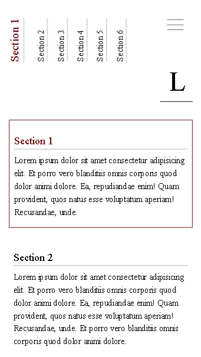

# Libris - landing page

## Table of contents
* [General info](#general-info)
* [Screenshots](#screenshots)
* [TODO](#to-do)

## General info
Landing page with dynamically created menu via JavaScript and minimalistic design

## TODO
- add transforms/transitions for intro screen and side menu
- experiment with section sizes and find a more precise way of detecting active sections
- add more pages

## Screenshots
Intro page             |  Linked sections  
:-------------------------:|:-------------------------:
  |     
